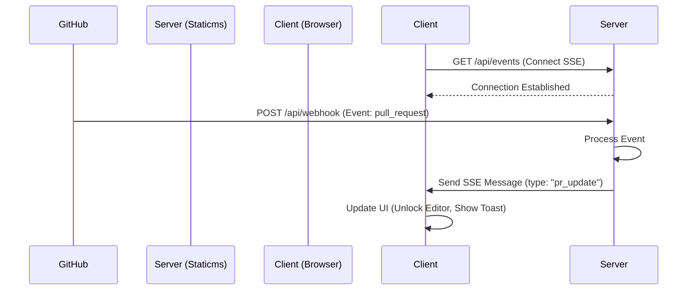

# リアルタイム・アーキテクチャ (SSE & Webhooks)

Staticms v2 は、Server-Sent Events (SSE)
を利用してクライアントインターフェースにリアルタイム更新を提供し、GitHub
からの外部イベントとの同期を確実にします。

## 1. 概要 (Overview)

ポーリングを行う代わりに、サーバーが接続されたクライアントへ更新をプッシュします。これは主に
GitHub Webhooks によってトリガーされます。



## 2. サーバーサイドの実装 (Server-Side Implementation)

### SSE エンドポイント

- **URL**: `/api/events`
- **Method**: `GET`
- **Headers**:
  - `Content-Type`: `text/event-stream`
  - `Cache-Control`: `no-cache`
  - `Connection`: `keep-alive`

サーバーは接続されたクライアントのセット (`Set<ServerSentEventTarget>`)
を保持します。Webhook
が到着すると、サーバーはこのセットを反復処理し、メッセージを配信します。

### Webhook ハンドラ

- **URL**: `/api/webhook` (またはテスト用の `/_debug`)
- **役割**: GitHub からのペイロードを受信し、関連情報を抽出し、SSE
  クライアントへブロードキャストします。

## 3. イベントタイプ (Event Types)

SSE 経由で送信されるメッセージは JSON 文字列です。`type`
フィールドによってペイロードの構造が決まります。

### `pr_update`

プルリクエスト (Pull Request) のステータスが変更されたときにトリガーされます。

```json
{
  "type": "pr_update",
  "prNumber": 123,
  "status": "merged" // "open" | "closed" | "merged"
}
```

### `repository_update`

ユーザーが新しいリポジトリに GitHub App
をインストールした時、またはリポジトリが作成・削除された時にトリガーされます。

```json
{
  "type": "repository_update",
  "event": "installation", // or "repository", "installation_repositories"
  "action": "created" // or "deleted", "added", "removed", etc.
}
```

## 4. クライアントサイドの実装 (Client-Side Implementation)

`ContentEditor` やその他のコンポーネントは、`EventSource` API
を使用して更新をリッスンします。

### 接続管理

- コンポーネントのマウント時に接続します。
- 接続はブラウザによって自動的に維持（Keep Alive）されます。
- リークを防ぐため、アンマウント時に接続を閉じます。

### イベントハンドリング

- `event.data` を JSON としてパースします。
- `type`
  を確認し、アクションを実行します（例：PRがマージされたらエディタのロックを解除する）。

## 5. セキュリティと制限 (Security & Limitations)

- **認証**: SSE エンドポイントはセッションクッキー (SameSite)
  によって保護されるべきです。
- **スケーラビリティ**: 単一インスタンス (Deno Deploy) の場合、インメモリの
  `Set`
  で十分です。マルチインスタンスの場合は、インスタンス間でイベントをブロードキャストするための
  Pub/Sub メカニズム（Redis や Deno KV Watch など）が必要です。
- **Deno KV Watch**: Deno KV は `.watch()` をサポートしており、分離された環境
  (Isolates) やサーバーインスタンス間でイベントを同期するために使用できます。
