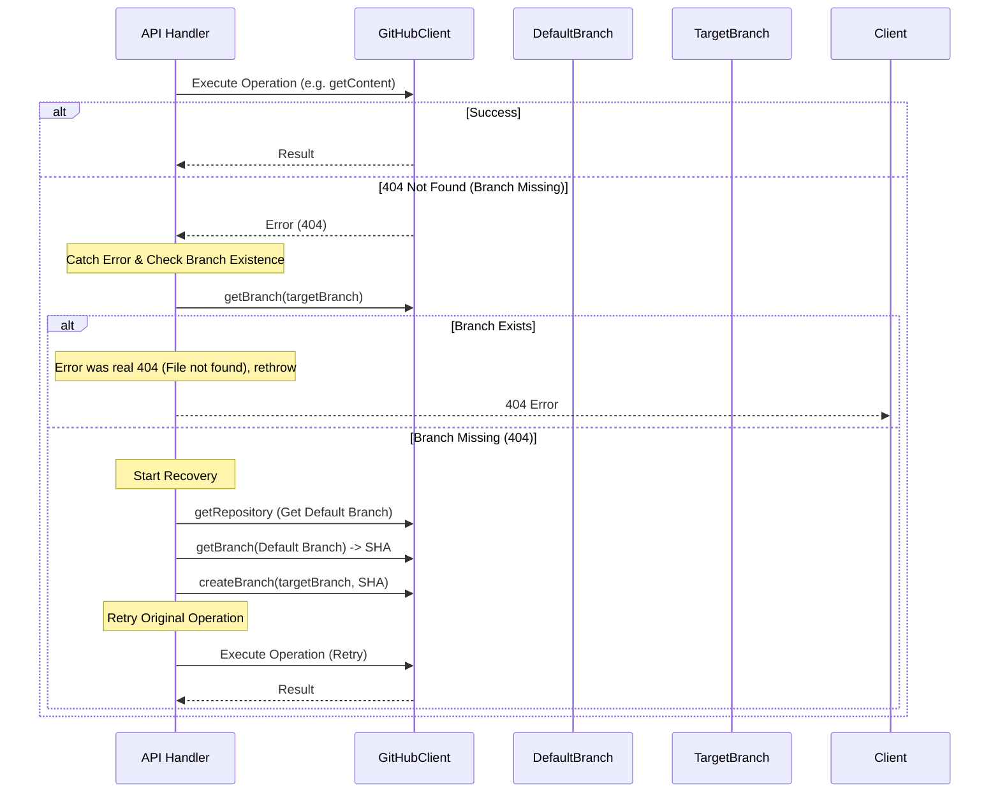

# ブランチ自動復旧 (Branch Fallback) 仕様書

## 1. 概要

Staticms v2 では、アプリの操作性とレスポンス速度を優先し、Deno KV 上にキャッシュされたブランチ設定を「正」として取り扱っています。しかし、リモートリポジトリ（GitHub）側でブランチが削除された場合、アプリからの参照や更新操作が 404 エラーで失敗するリスクがあります。

本仕様書では、GitHub API 操作時に「ターゲットブランチが見つからない」エラーが発生した場合に、**自動的にブランチを再作成（復旧）して操作をリトライする**フォールバックロジックを定義します。

この機能により、ユーザーはリモート側の状況を意識することなく、Staticms 上の設定（KV）を信頼して作業を継続できます。

## 2. 適用範囲

以下の条件を満たすサーバーサイド処理に適用します。

- **対象操作**:
  - コンテンツの取得 (`getContent`)
  - ファイルの作成・更新・削除 (`deleteFile`, `createBlob`, `updateTree` 等)
  - その他、特定のブランチをターゲットとする参照・更新系操作
- **対象外**:
  - ブランチ管理機能そのもの（意図してブランチを削除する場合など）
  - リポジトリ設定画面での操作（これらは明示的な操作であるため）

## 3. ロジックフロー

### 3.1 処理の流れ



### 3.2 詳細手順

1. **操作実行**:
   任意の GitHub API 操作を実行します。
2. **エラー捕捉**:
   `GitHubAPIError` を捕捉し、ステータスコードが `404` であることを確認します。
   ※ GitHub API は「ブランチがない」場合も「ファイルがない」場合も 404 を返すため、この時点では原因を特定できません。
3. **ブランチ存在確認**:
   本来あるべきターゲットブランチ (`ref`) に対して `getBranch` を実行します。
   - **成功 (200)**: ブランチは存在します。元の 404 エラーは「ファイルが存在しない」等の正当なエラーでした。→ **エラーを再スロー**。
   - **失敗 (404)**: ブランチ自体が存在しません。→ **復旧フェーズへ**。
4. **ブランチ復旧**:
   1. リポジトリのデフォルトブランチ（`main` 等）情報を取得。
   2. デフォルトブランチの最新 SHA を取得。
   3. ターゲットブランチを、デフォルトブランチの SHA から作成 (`createBranch`)。
5. **リトライ**:
   元の操作を再度実行します。
   - 再度失敗した場合は、そのエラーをそのまま返します（無限ループ防止のためリトライは1回のみ）。

## 4. 実装設計

### 4.1 ユーティリティ関数: `executeWithBranchFallback`

既存の `GitHubUserClient` を変更せず、API ハンドラ層で利用できる高階関数 `executeWithBranchFallback` を実装します。
この関数は `src/server/services/github_resilient.ts` に配置します。

```typescript
// src/server/services/github_resilient.ts

import { GitHubUserClient, GitHubAPIError } from "@/server/github.ts";

interface BranchFallbackContext {
  client: GitHubUserClient;
  owner: string;
  repo: string;
  branch?: string; // 対象ブランチ（指定がない場合は自動復旧の対象外）
}

/**
 * Executes a GitHub operation with automatic branch recovery.
 * If the operation fails due to a missing branch, it attempts to create the branch
 * from the repository's default branch and retries the operation.
 */
export async function executeWithBranchFallback<T>(
  ctx: BranchFallbackContext,
  operation: () => Promise<T>
): Promise<T> {
  const { client, owner, repo, branch } = ctx;

  try {
    return await operation();
  } catch (error) {
    // 1. Check if potential branch error
    if (!branch || !(error instanceof GitHubAPIError) || error.status !== 404) {
      throw error;
    }

    // 2. Verify if branch actually exists
    try {
      await client.getBranch(owner, repo, branch);
      // If getBranch succeeds, the branch exists.
      // The original 404 was likely "file not found", so we rethrow.
      throw error;
    } catch (branchError) {
      if (
        !(branchError instanceof GitHubAPIError) ||
        branchError.status !== 404
      ) {
        // Unexpected error during branch check
        throw error;
      }
      // Branch check returned 404, proving the branch is missing.
      // Proceed to recovery.
    }

    // 3. Recover: Create Branch from Default
    console.log(`[Fallback] Branch '${branch}' missing. Recovering...`);
    try {
      // Fetch Default Branch Name
      const repoInfo = await client.getRepository(owner, repo);
      const defaultBranch = repoInfo.default_branch;

      // Fetch Default Branch SHA
      // deno-lint-ignore no-explicit-any
      const refData: any = await client.getBranch(owner, repo, defaultBranch);
      const sha = refData.object.sha;

      // Create Target Branch
      await client.createBranch(owner, repo, branch, sha);
      console.log(`[Fallback] Branch '${branch}' created from '${defaultBranch}'.`);
    } catch (recoveryError) {
      console.error("[Fallback] Failed to recover branch:", recoveryError);
      throw error; // Throw original error if recovery fails
    }

    // 4. Retry Original Operation
    return await operation();
  }
}
```

### 4.2 利用例 (API Handler)

`src/server/api/content.ts` 等のハンドラで以下のように適用します。

```typescript
import { executeWithBranchFallback } from "@/server/services/github_resilient.ts";

// ...

// Before
// const data = await client.getContent(owner, repo, path, branch);

// After
const data = await executeWithBranchFallback(
  { client, owner, repo, branch },
  () => client.getContent(owner, repo, path, branch)
);
```

## 5. エラーハンドリングの詳細

- **同時実行制御**:
  短期間に複数のリクエストが来て同時に復旧処理が走った場合、2回目以降の `createBranch` は「Already exists (422)」エラーになります。
  これに対応するため、復旧ステップでの `createBranch` エラーは（既に存在するという理由であれば）許容し、リトライに進むように実装を調整します。

- **権限エラー (401/403)**:
  ブランチ復旧処理には書き込み権限が必要です。権限不足で失敗した場合は、元の 404 エラー（または権限エラー）を返します。

## 6. 今後の拡張

- 現状は「デフォルトブランチから復旧」のみですが、将来的には「最後に成功したコミットSHA」をKVに保存しておき、そこから復旧する等の高度なロジックも検討可能です。
- エラーログは `console.error` だけでなく、監視システム（あれば）にも通知すべきです。
